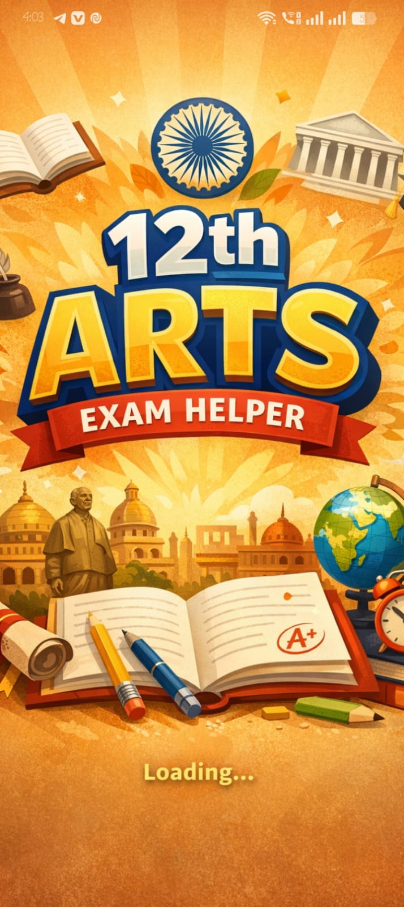
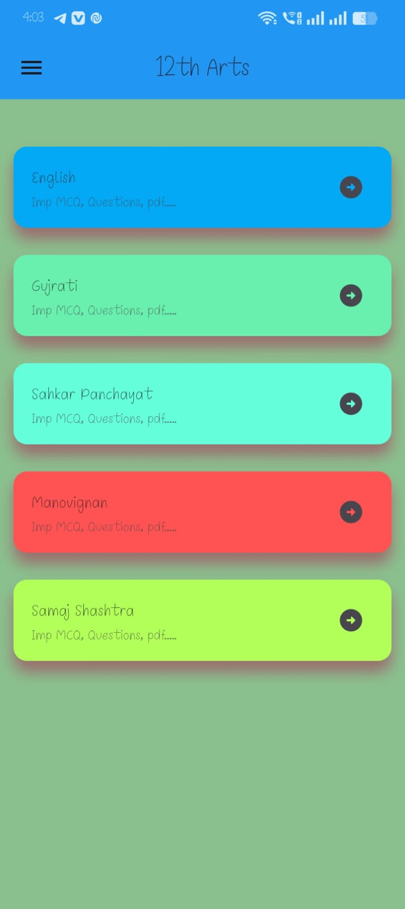
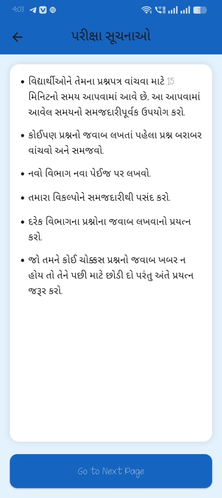
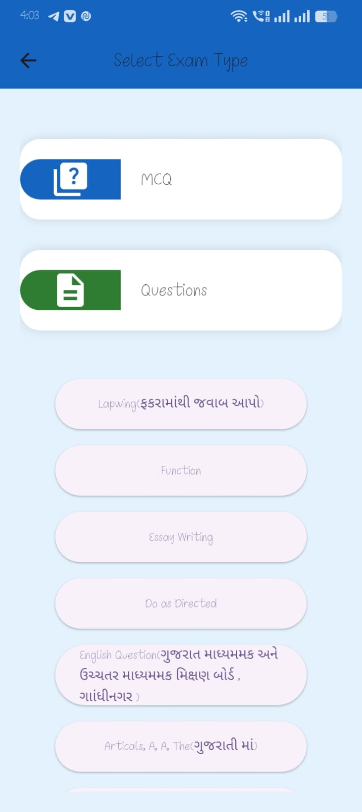

📚 ExamHelper – Study Companion for 12th Students

ExamHelper is a Flutter-based mobile application designed to help 12th standard students prepare for exams efficiently.
The app provides study materials, notes, and useful resources that make exam preparation simple and organized.

✨ Features

📖 Subject-wise study material
📝 Quick revision notes
📂 Organized content for easy navigation
📱 Clean and simple user interface
⚡ Fast performance for smooth study experience

🛠️ Tech Stack

Framework: Flutter
Language: Dart
IDE: Android Studio / VS Code

📸 App Screenshots

<h2 align="center">App Screenshots</h2>

  
  
  

  
  

🎥 App Demo

<video width="600" controls>
  <source src="images/video.mp4" type="video/mp4">
</video>>
